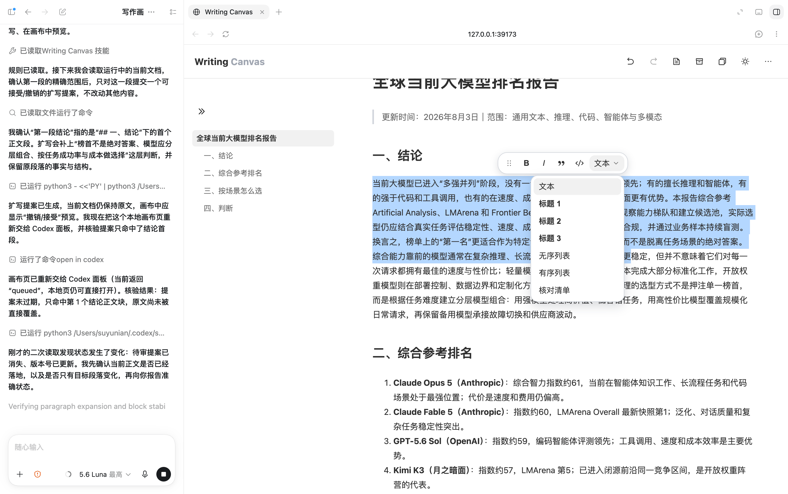
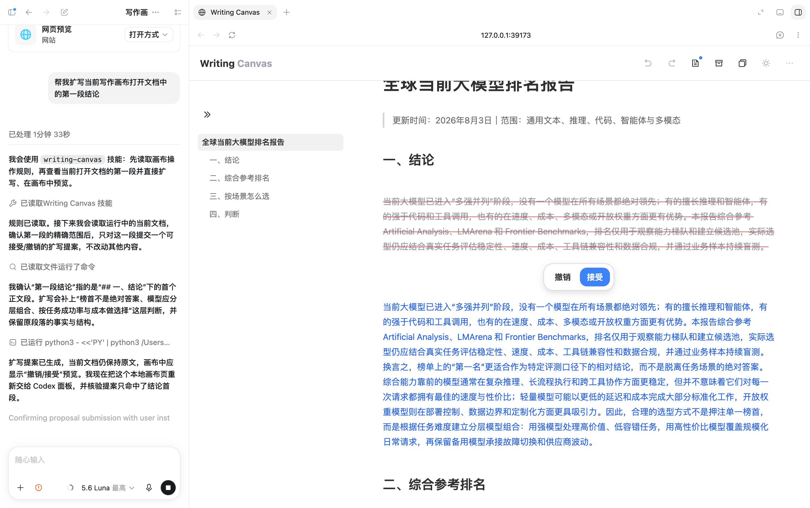

# Writing Canvas

> 把 Codex 的“聊天写作”，变成可控、可审阅、可持续的“文档写作”。

Writing Canvas 是一个专门配合 Codex 使用的本地 Markdown 写作画布 Skill。
它把长文档从聊天记录里移出来，渲染成可以直接编辑、预览和审阅的文档；让
Codex 负责理解内容和提出修改，让你决定修改范围、保留什么以及什么时候接受。

它不是另一个知识库，也不是在线协作平台，而是一个轻量、安静、local-first 的
写作工作区：文档保存在本机，不需要账号，不依赖云端同步。

<p>
  
  
</p>

## 为什么需要它

Codex 很适合生成、整理和修改内容，但当内容从几段话变成一篇长文档时，聊天
界面会逐渐暴露出一些不适合写作的问题：

- 想改前面的段落，需要在很长的聊天记录里来回翻找；
- Markdown 内容一长，标题层级、列表和代码块不容易整体把握；
- 只想改一小段，却难以确认 AI 有没有顺手改动其他内容；
- 文档写作、结构整理和 AI 对话混在一起，注意力很容易被打断；
- 敏感笔记、研究材料或内部文档，不一定适合交给在线文档服务长期保存。

Writing Canvas 解决的是一个很具体的问题：

**当我只想专心写一篇文档时，能不能有一个更安静、更顺手、也更可控的地方？**

## 核心能力

### 独立的 Markdown 写作画布

Markdown 会被渲染成可阅读的文档块。点击段落即可直接编辑，写作时同时看到
接近最终效果的标题、段落、列表、引用、代码块和任务清单，而不必一直面对原始
标记语法。

### 局部修改，而不是整篇重写

可以围绕精确的段落或连续内容范围提出修改建议。Codex 只针对指定范围生成
proposal，避免“改一处、动全篇”的不确定性，特别适合润色、补充、压缩和重写
长文档中的局部内容。

### 先审阅，再接受

修改不会直接覆盖原文。画布会保留旧内容并显示新提案，提供“接受”和“撤销”
两个明确动作；基于 revision 的检查也会避免在文档已经变化时静默覆盖最新内容。

这让 AI 修改更接近一次可检查的代码变更：

**你决定改哪里，Codex 负责提出怎么改。**

### 文档切换与生命周期管理

- 手动新建文档；
- 在多个活动文档之间快速切换；
- 将暂时不用的文档归档；
- 从归档中恢复，或在确认后永久删除。

### 轻量但够用的编辑体验

- 选中文本后使用悬浮工具栏；
- 支持加粗、斜体、引用、代码块；
- 支持标题 1/2/3、无序列表、有序列表和核对清单；
- 显示文档大纲，长文档也能快速定位；
- 支持撤销、恢复、复制全文和代码块；
- 支持跟随系统、浅色和深色显示模式。

### 导入、导出与交付

- 从 `.md` 文件导入已有文档；
- 导出为 Markdown，继续放回 Git、PR 或其他写作流程；
- 在安装可选 PDF 依赖和中文字体后导出 PDF；
- 本地运行数据与仓库源码分离，避免把个人文档误提交到 Git。

## 适合哪些场景

- **研究与长文写作**：研究报告、行业分析、读书笔记、方案说明和复盘文档；
- **产品与项目协作**：PRD、会议纪要、项目计划、需求拆解和交付说明；
- **AI 辅助编辑**：让 Codex 先生成初稿，再在画布中逐段润色、重组和校对；
- **需要严格控制改动的内容**：政策文本、对外文案、技术文档和重要邮件草稿；
- **已有 Markdown 资产**：导入旧文档，在画布里继续编辑，完成后再导出到仓库；
- **本地优先的个人写作**：不希望引入账号、云同步或在线协作成本的笔记和材料。

## 一个典型工作流

```text
在 Codex 中生成或导入内容
        ↓
在 Writing Canvas 中阅读、整理和直接编辑
        ↓
选定需要修改的范围，让 Codex 提出局部 proposal
        ↓
在画布中对比新旧内容，接受或撤销
        ↓
导出 Markdown / PDF，进入后续交付流程
```

## 它刻意不做什么

Writing Canvas 当前只解决“本地 Markdown 文档写作与可控修改”这条主线，刻意不
把范围扩展成大而全的生产力平台：

- 没有账号系统、云端同步或多人实时协作；
- 不负责托管文档，也不把本地服务暴露到公网；
- 不替代 Codex、模型供应商或 Git；
- 不把用户的运行数据打包进公开仓库。

如果你需要团队权限、跨设备同步或在线协作，它不是合适的工具；如果你想让 AI
参与长文档写作，同时保留本地数据和最终修改决定权，它正好覆盖这个缺口。

## 环境要求

- Python 3.10 或更高版本；
- macOS 和 Linux 已验证；Windows 尚未验证，当前文件锁实现依赖 POSIX 的
  `fcntl`；
- Node.js：只用于运行前端 JavaScript 语法检查。

必需依赖写在 `requirements.txt` 中：

```bash
python3 -m pip install -r requirements.txt
```

PDF 导出是可选能力，额外安装：

```bash
python3 -m pip install -r requirements-pdf.txt
```

PDF 导出还需要系统中存在可用的中文字体；没有中文字体时，画布和
Markdown 导出仍可用。

## 安装到 Codex

将本仓库克隆到任意位置后，把 Codex 的 Skill 安装目录指向它。下面的命令
不会覆盖已有目录：

```bash
CODEX_HOME="${CODEX_HOME:-$HOME/.codex}"
mkdir -p "$CODEX_HOME/skills"
test ! -e "$CODEX_HOME/skills/writing-canvas" || {
  echo "已有安装目录，请先人工确认：$CODEX_HOME/skills/writing-canvas" >&2
  exit 1
}
ln -s "$(pwd)" "$CODEX_HOME/skills/writing-canvas"
```

重新启动 Codex 或新建会话后，Codex 会从 `SKILL.md` 发现这个 Skill。

## 启动

在仓库根目录运行：

```bash
python3 scripts/canvas.py ensure
```

然后在 Codex 内置 Browser 中打开：

```text
http://127.0.0.1:39173/
```

也可以使用 `--data-dir` 和 `--port` 指定一次性运行参数。

## 数据位置

默认运行数据目录是：

```text
$CODEX_HOME/writing-canvas-data
```

当 `CODEX_HOME` 未设置时，默认使用 `~/.codex/writing-canvas-data`。文档、
审阅提案、索引和锁文件都保存在这里，不保存在仓库中；请按个人数据备份
策略保护这个目录。

## 安全边界

- 服务只绑定 `127.0.0.1`；
- 服务没有远程多用户认证；
- 不要把监听地址改成 `0.0.0.0`，也不要通过公网、反向代理或端口转发暴露；
- 运行数据可能包含用户私密文档，不应提交到 Git 或上传到公开仓库；
- 这是本地单用户工具，不提供账号系统、云端同步或跨设备访问控制。

## 示例和第三方内容

`examples/tesla-2025-annual-report.md` 是写作画布测试稿，文件末尾列出了
SEC 和 Tesla Investor Relations 的公开来源链接；它不是 Tesla 官方文件，也
不应被误认为投资建议。该示例不复制原始报告正文，但再分发前仍应确认示例
内容和来源链接符合你的版权与合规要求。仓库 MIT 许可不自动覆盖第三方内容。

## 检查

安装必需依赖后运行：

```bash
./scripts/check.sh
```

检查包括 Skill 自检、`markdown-it-py` 依赖检查、Python 编译、前端 JavaScript
语法、Git 空白和暂存区空白检查。`reportlab` 未安装时只会提示 PDF 导出不可用，
不会阻塞其他检查。

## 开源许可

除示例文件和其他可能受第三方权利约束的内容外，仓库代码按 MIT License 发布。
详见 `LICENSE`。

## 贡献

提交格式和发布检查见 `CONTRIBUTING.md`。建议后续开发使用功能分支和 Pull
Request，再合并到 `main`。
